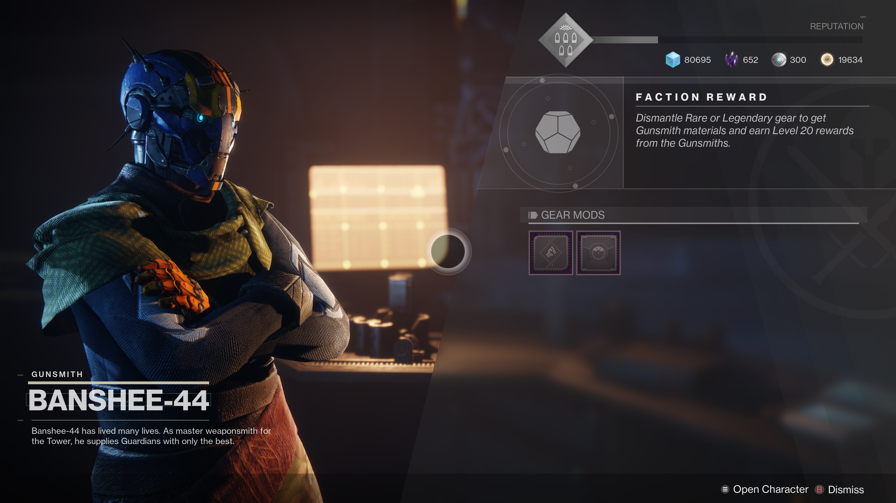

# Contributing Guide

If you're new to contributing to open source software
[this guide](https://opensource.guide/how-to-contribute/) guide is a great read.

## Not sure where to start?

A great place to jump in are issues labeled[Beginner Friendly](https://github.com/cujarrett/banshee-44-mods-bot/labels/Beginner%20Friendly).

## Chat

Feel free to join the [Banshee-44 Mods Bot Discord](https://discord.gg/Pv3xrPV) if you have questions.

## Pull Request Checklist

- [ ] - Ensure 100% code coverage with thoughtful unit and integration tests
- [ ] - Documentation is updated if needed
- [ ] - Passing CI pipeline

## Background


Banshee-44 is the gunsmith in the popular [Destiny video game](https://www.destinythegame.com/). Banshee-44 sells mods
for armor and weapons on a daily rotating schedule. This project is a Node JS Twitter bot that tweets Destiny 2's
Banshee-44 daily mods available for sale.

## Developer Setup

Setup and use requires [Git](https://git-scm.com/), [Node JS](https://nodejs.org/en/), and a text editor such as
[VS Code](https://code.visualstudio.com/).

This project is built for Node 8 and up but we develop using Node LTS and npm. You can check your node version with
`node -v` and your npm version with `npm -v`.

If you're on a Mac, I'd suggest using [Homebrew](https://brew.sh/) for installing the required software listed in Setup.

## Code Setup

Clone this project with Git to your prefered location.

## Configuration

For local development and testing, create a `.banshee-44-mods-bot.ini` file your root folder. You'll need to Twitter API
settings, you can get them [here](https://apps.twitter.com/app/new).

Example:

```ini
twitterConsumerApiKey = "<twitterConsumerApiKey here>"
twitterConsumerSecret = "<twitterConsumerSecret here>"
twitterAccessToken = "<twitterAccessToken here>"
twitterAccessTokenSecret = "<twitterAccessTokenSecret here>"
```

#### Cloning & Dependency Installations

```sh
git clone https://github.com/cujarrett/banshee-44-mods-bot.git
cd banshee-44-mods-bot
npm install
```

#### Run Linting

Finds problematic patterns or code that doesn’t adhere to certain style guidelines

```sh
npm run lint
```

#### Fix linting errors (automated)

```sh
npm run fix-lint
```

#### Run tests

Runs the unit and integration tests.

```sh
npm run test
```

#### Run Continuous Integration pipeline

Runs linting and tests, same as in the CI pipeline.

```sh
npm run ci
```

#### Start app

```sh
npm run start
```

### Commit Message Guidelines

This project follows the [Conventional Commits](https://www.conventionalcommits.org/en/v1.0.0-beta.3/) specification to
aid in automated releases and change log generation. [Commitlint](https://github.com/conventional-changelog/commitlint)
is enabled and ran as a `commit-msg` hook to enforce the commit format.
[Commitizen](http://commitizen.github.io/cz-cli/) can be used to prompt through any requirements at commit time
`npm run commit` (or `git cz` if Commitizen is installed globally).

In short, if a commit will be fixing a bug, prefix the commit message with `fix:`

```sh
fix: my bug fix
```

```sh
feat: my new feature
```

Commits with `fix:` prefix will show up in the generated changelog as bullets under the `Bug Fixes:` section, and
`feat:` prefixed messages will show under the `Features:` section. For more on the available prefixes/rules, see
[here](https://github.com/conventional-changelog/commitlint/tree/master/%40commitlint/config-conventional#rules).
