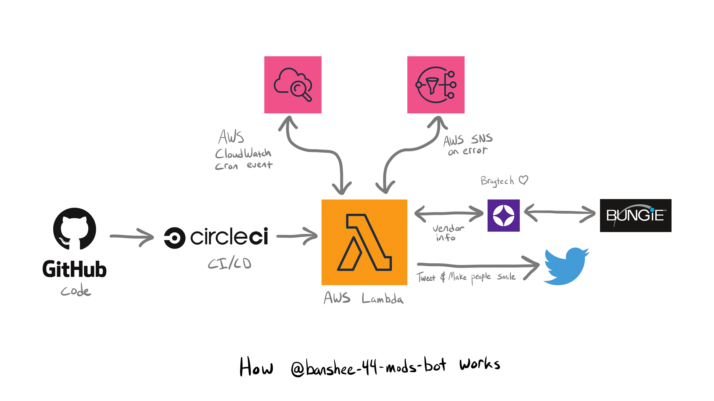

  
  
  

## What's it do?
It's a Node JS Twitter bot that tweets Destiny 2's Banshee-44 daily mods available for sale. Check
out [Banshee-44's current mods for sale right now on Twitter](https://twitter.com/banshee44mods).

## How's it work?

## Questions & Contact
Feel free to join the [Banshee-44 Mods Bot Discord](https://discord.gg/jAA5U52) if you have questions.

## Want to Contribute?
[Check out the contributing guide](CONTRIBUTING.md)

## Thank You!
- Big thanks to [Tom Chapman](https://github.com/justrealmilk) for his help with the Bungie API.

## Changelog
[banshee-44-mods-bot changelog](CHANGELOG.md)

  Made with :heart:, JavaScript, and GitHub. Powered by <a href="https://braytech.org/">Braytech</a> and AWS.

