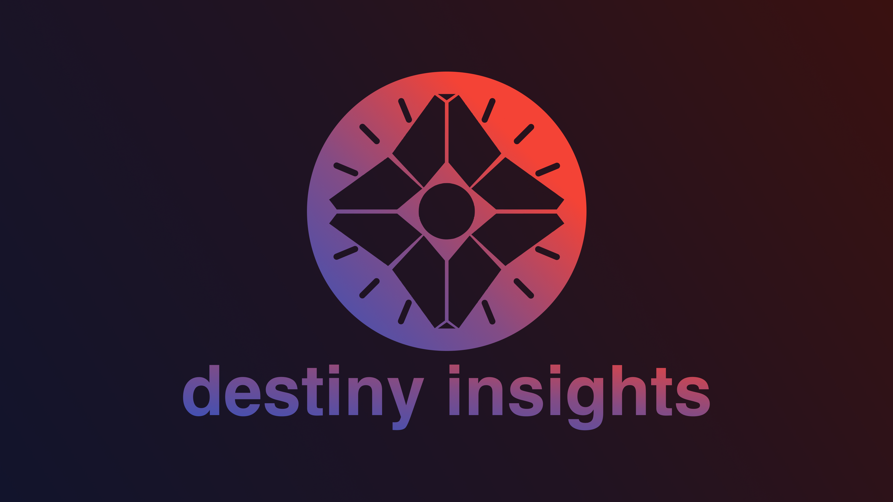

  
  
  
  
  

## What is it?

It's a serverless Twitter bot powered by JavaScript and AWS that tweets Destiny
2's note worthy items such as mods, high stat armor, or well rolled weapons
available for sale. Check out
[@destinyinsights right now on Twitter](https://twitter.com/destinyinsights).

## Questions & Contact

Feel free to join the [Discord](https://discord.gg/jAA5U52) if you have
questions.

## Want to Contribute?

[Check out the contributing guide](CONTRIBUTING.md)

## Thank You!

Big thanks to [Tom Chapman](https://github.com/justrealmilk) for his help with
Bungie's API.

## Changelog

[destiny-insights-bot changelog](CHANGELOG.md)

  Made with :heart:, JavaScript, and GitHub. Powered by AWS.

